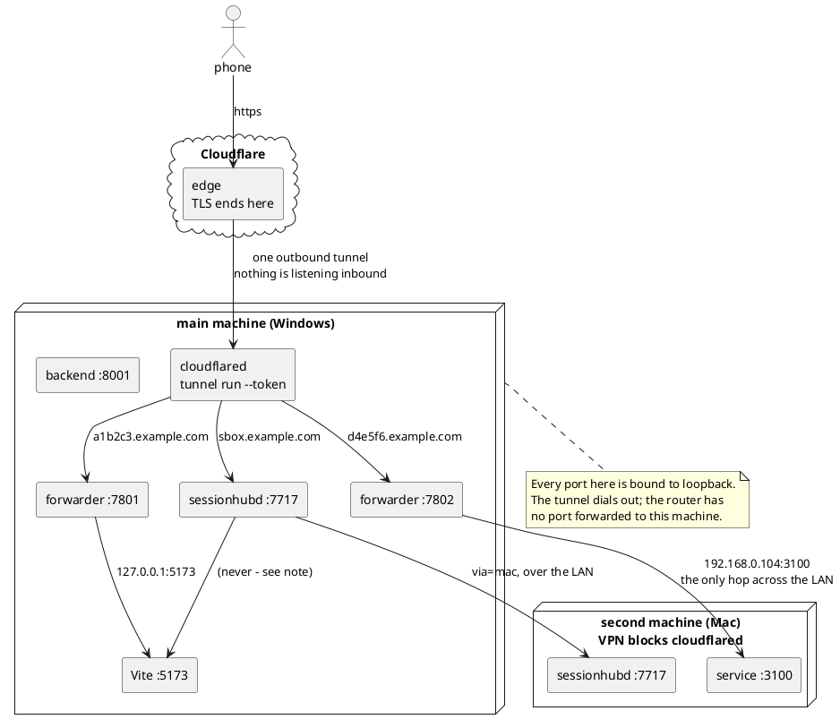
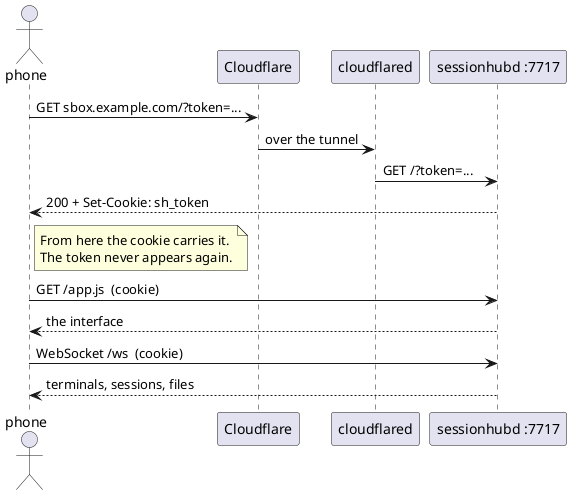
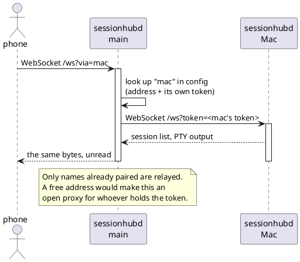
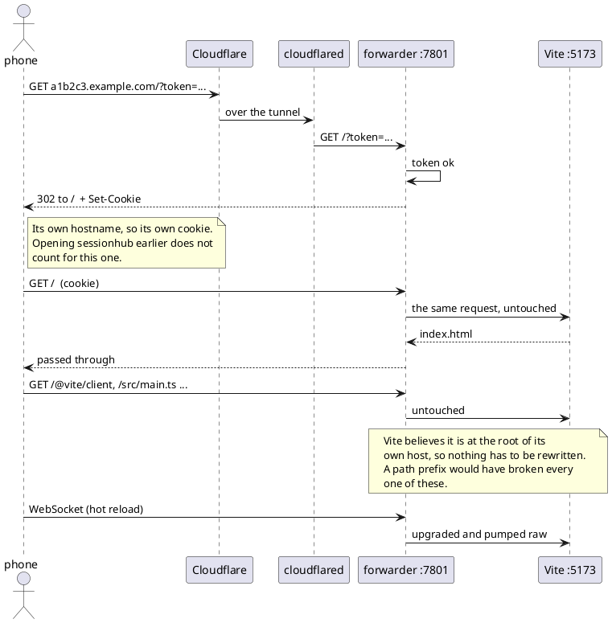
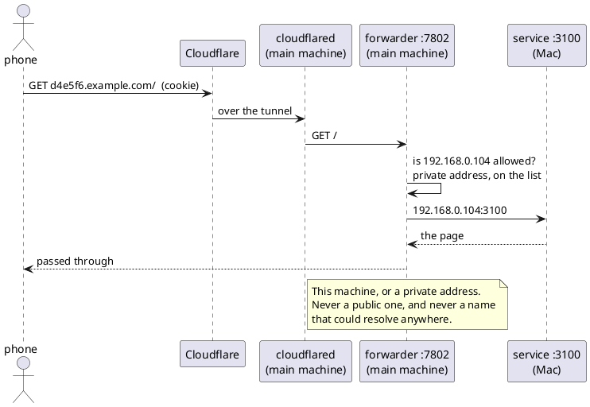
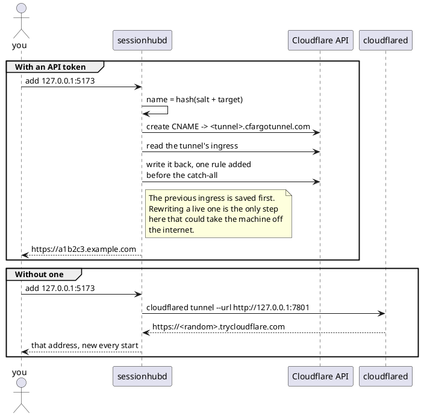

# Reaching it from a phone

How a phone on mobile data gets to a terminal on a machine at home, and to the
dev servers running beside it — including one on a second machine that cannot
run a tunnel of its own.

Hostnames below are placeholders. The real ones live in `~/.sessionhub/config.toml`
and are salted hashes of what they point at, so they cannot be guessed from the
port they lead to.

## The shape of it

The daemon never talks to Vite — that arrow is only there to be denied. A
forwarded address gets its own listener, and that listener is the only thing
that ever dials the target.

## Opening sessionhub itself

The token rides in the address once, then lives in a cookie for that hostname.

## A terminal on the second machine

The phone never reaches the Mac directly. It asks the main daemon, which relays
the whole WebSocket byte for byte using the token it was paired with.

## A dev server, on this machine

Two loopbacks are tried, not just the one written down: a dev server told to
listen on `localhost` may bind `::1` alone, which a browser reaches and a
literal `127.0.0.1` does not.

## A service on the second machine

Same path until the last hop. cloudflared runs on the main machine because the
Mac's VPN will not let it; only the final dial crosses the LAN.

## Where a hostname comes from

Two ways, and the difference is whether the name stays put.

## What holds it shut

- Nothing listens for inbound connections at home. cloudflared dials out.
- Every sessionhub port is bound to loopback; the forwarders too.
- Only addresses added by hand are reachable, and only loopback or a private
  address — a leaked token cannot become a way into the whole network.
- Each hostname is its own origin with its own cookie, so reaching one says
  nothing about reaching the next.
- The names are salted, so knowing one tells you nothing about the others.
- What sits behind them is still a dev server. Vite will serve files from
  outside the project through `/@fs/`; the token in front is what makes that
  survivable.
