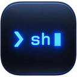
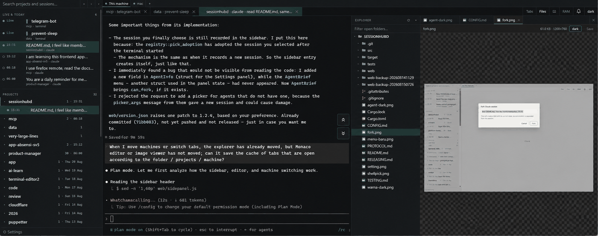

# sessionhub



sessionhub keeps coding-agent terminals alive in a daemon and makes them
available in a browser. Close the browser, switch computers, or check from a
phone; the agent keeps running.

It supports Claude Code, opencode, and pi. There is no chat layer or task
manager: the main interface is the agent's own terminal.



## Why

I wanted agent sessions to survive a closed laptop and remain usable from a
phone. sessionhub does that with a daemon that owns the PTYs and a browser page
that connects to them. It passes terminal bytes through unchanged and uses each
CLI's existing session registry, so old sessions remain available to resume.

[T3 Code](https://betterstack.com/community/guides/ai/t3-code/) is a better fit
for a task/chat workflow. [herdr](https://herdr.dev/) is a better fit for a
terminal TUI over SSH. sessionhub is for using the agent's raw terminal from a
browser.

## Features

- Sessions survive the browser closing
- Raw PTY passthrough with no prompt injection
- Resume and fork sessions created inside or outside sessionhub
- Saved terminals that start with the daemon
- Several machines in one window; remote tokens stay on the daemon
- Phone controls for Esc, Enter, Shift+Tab, Ctrl, arrows, paste, and uploads
- Busy/finished status, finish chime, tab colours, CPU, and RAM usage
- Monaco file panel with drag-and-drop and paste uploads
- Self-update and Cloudflare access from Settings
- One binary with no frontend build step

| Shortcut | Action |
|---|---|
| `Ctrl/Cmd+K` | command palette |
| `Ctrl/Cmd+B` | hide/show the sidebar |
| `Ctrl/Cmd+1..9` | switch to the nth terminal |
| `Ctrl/Cmd+W` | close the tab; the terminal keeps running |
| `Ctrl/Cmd+Shift+W` | kill the terminal, with confirmation |

Every other key goes to the agent untouched.

## Install and run

Download the binary from
[Releases](https://github.com/goldalworming/sessionhub/releases/latest) and run
it. The macOS release includes an unsigned `.app`; open it the first time with
right-click → Open. The Linux x86_64 build is statically linked with musl.

To build from source, install stable Rust and run `cargo build --release`.

```text
sessionhubd start          # start the daemon and open the browser
sessionhubd status         # show address, uptime, and live terminals
sessionhubd stop
sessionhubd restart        # stop and start again
```

`start` prints a tokenized address. After the first open, a cookie keeps that
device signed in. Run `start` again to print the address again. The tray or menu
bar icon also provides the address, log, and stop action.

`restart` ends every live terminal, so it refuses to run while terminals are
active unless you pass `--force`.

## Access from outside

Use **Settings → Cloudflare** to expose sessionhub or another local service
through a Cloudflare tunnel. For LAN access, use **Settings → Network access**.
See [CONFIG.md](CONFIG.md#access-from-outside) for setup and pairing.

> **This exposes a shell.** Anyone with the address and token can run commands
> as you. Use Cloudflare Access or another authentication layer for internet
> access. If a URL leaks, rotate the token in **Settings → Network access → New
> token** or run `sessionhubd token rotate`.

On a public server, leave Network access off so sessionhub stays on
`127.0.0.1:7717`. Put a Cloudflare tunnel or TLS reverse proxy in front of it.
Serve sessionhub at the root of a hostname, not a subpath. Reverse proxies must
support WebSocket upgrades and long-lived connections.

## Using another machine

A paired machine can run commands and transfer files:

```text
sessionhubd machines
sessionhubd run  --on NAME [--cwd DIR] [--timeout S] -- COMMAND…
sessionhubd push --on NAME <local-file> <remote-path>
sessionhubd pull --on NAME <remote-path> <local-file>
```

`run` forwards stdout and stderr and exits with the remote command's exit code.
`push` and `pull` transfer one file at a time. Use an archive for a directory.

To tell an agent about these commands, add this to the project's `CLAUDE.md`:

> This machine can reach other computers through sessionhub. `sessionhubd
> machines` lists them; `sessionhubd run --on NAME -- COMMAND` runs a command
> there and returns its exit code; `sessionhubd push` and `pull` move one file.

Remote commands are controlled by **Settings → Network access → Remote
commands** and are logged on the machine that runs them. See
[CONFIG.md](CONFIG.md#running-commands-there) for pairing, security, and tunnel
setup.

## Known limits

- Each terminal keeps the last 2 MB of output. History is lost when the daemon stops.
- A slow client can lose output chunks. Reattaching restores its current screen.
- pi session parsing has not been tested against real session data.

## Other documents

- [CONFIG.md](CONFIG.md) — configuration, agents, network access, and pairing
- [PROTOCOL.md](PROTOCOL.md) — WebSocket protocol for writing a client
- [TESTING.md](TESTING.md) — acceptance results and untested areas
