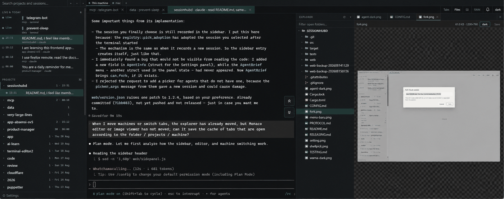

# sessionhub


sessionhub keeps coding-agent terminals alive in a daemon and makes them
available in a browser. Close the browser, switch computers, or check from a
phone; the agent keeps running.

It has been tested with Claude Code, Codex CLI, opencode, and Oh My Pi. There
is no chat layer or task manager: the main interface is the agent's own
terminal.



## Why

I wanted agent sessions to survive a closed laptop and remain usable from a
phone. sessionhub does that with a daemon that owns the PTYs and a browser page
that connects to them. It passes terminal bytes through unchanged and uses each
CLI's existing session registry, so old sessions remain available to resume.

[T3 Code](https://betterstack.com/community/guides/ai/t3-code/) is a better fit
for a task/chat workflow. [herdr](https://herdr.dev/) is a better fit for a
terminal TUI over SSH. sessionhub is for using the agent's raw terminal from a
browser.

## Features

- Sessions survive the browser closing
- Raw PTY passthrough with no prompt injection
- Resume and fork sessions created inside or outside sessionhub
- Saved terminals that start with the daemon
- Several machines in one window; remote tokens stay on the daemon
- Phone controls for Esc, Enter, Shift+Tab, Ctrl, arrows, paste, and uploads
- Busy/finished status, finish chime, tab colours, CPU, and RAM usage
- Monaco file panel with drag-and-drop and paste uploads
- Self-update and Cloudflare access from Settings
- One binary with no frontend build step

| Shortcut | Action |
|---|---|
| `Ctrl/Cmd+K` | command palette |
| `Ctrl/Cmd+B` | hide/show the sidebar |
| `Ctrl/Cmd+1..9` | switch to the nth terminal |
| `Ctrl/Cmd+W` | close the tab; the terminal keeps running |
| `Ctrl/Cmd+Shift+W` | kill the terminal, with confirmation |

Every other key goes to the agent untouched.

## Install and run

Download the binary from
[Releases](https://github.com/goldalworming/sessionhub/releases/latest) and run
it. The macOS release includes an unsigned `.app`; open it the first time with
right-click → Open. The Linux x86_64 build is statically linked with musl.

To build from source, install stable Rust and run `cargo build --release`.

```text
sessionhubd start          # start the daemon and open the browser
sessionhubd status         # show address, uptime, and live terminals
sessionhubd stop
sessionhubd restart        # stop and start again
```

`start` prints a tokenized address. After the first open, a cookie keeps that
device signed in. Run `start` again to print the address again. The tray or menu
bar icon also provides the address, log, and stop action.

`restart` ends every live terminal, so it refuses to run while terminals are
active unless you pass `--force`.

## Access from outside

Use **Settings → Cloudflare** to expose sessionhub or another local service
through a Cloudflare tunnel. For LAN access, use **Settings → Network access**.
See [CONFIG.md](CONFIG.md#access-from-outside) for setup and pairing.

> **This exposes a shell.** Anyone with the address and token can run commands
> as you. Use Cloudflare Access or another authentication layer for internet
> access. If a URL leaks, rotate the token in **Settings → Network access → New
> token** or run `sessionhubd token rotate`.

On a public server, leave Network access off so sessionhub stays on
`127.0.0.1:7717`. Put a Cloudflare tunnel or TLS reverse proxy in front of it.
Serve sessionhub at the root of a hostname, not a subpath. Reverse proxies must
support WebSocket upgrades and long-lived connections.

## Using another machine

A paired machine can run commands and transfer files:

```text
sessionhubd machines
sessionhubd run  --on NAME [--cwd DIR] [--timeout S] -- COMMAND…
sessionhubd push --on NAME <local-file> <remote-path>
sessionhubd pull --on NAME <remote-path> <local-file>
```

`run` forwards stdout and stderr and exits with the remote command's exit code.
`push` and `pull` transfer one file at a time. Use an archive for a directory.

To tell an agent about these commands, add this to the project's `CLAUDE.md`:

> This machine can reach other computers through sessionhub. `sessionhubd
> machines` lists them; `sessionhubd run --on NAME -- COMMAND` runs a command
> there and returns its exit code; `sessionhubd push` and `pull` move one file.

Remote commands are controlled by **Settings → Network access → Remote
commands** and are logged on the machine that runs them. See
[CONFIG.md](CONFIG.md#running-commands-there) for pairing, security, and tunnel
setup.

## Scripted control

A script or another program on the same machine (a workflow engine, a build
step) can create and drive an agent terminal directly, without a human ever
opening it in the browser first. The terminal it spawns is a normal terminal:
it appears live in the browser immediately and can be typed into from there
at the same time.

```text
sessionhubd spawn --agent omp --project ~/code/demo --name builder
sessionhubd send builder --file task.md
sessionhubd wait builder --idle 20 --timeout 1800
sessionhubd capture builder
```

```text
sessionhubd ls [--json]
sessionhubd spawn --agent NAME --project DIR [--resume ID] [--name LABEL] [--env NAME=VALUE | --env NAME]... [--on MACHINE]
sessionhubd send <id-or-name> [TEXT | --file PATH] [--enter] [--key NAME]... [--from LABEL] [--raw] [--verify] [--on MACHINE]
sessionhubd capture <id-or-name> [--lines N] [--raw] [--json] [--on MACHINE]
sessionhubd wait <id-or-name> [--idle S] [--timeout S] [--on MACHINE]
```

`ls` lists live terminals with their id, name, agent, project, and status.
`spawn` prints the new terminal's id on stdout, so `id=$(sessionhubd spawn
...)` works in a script; `--name` gives it a label other commands can target
instead of the id, valid only while that terminal is alive (it is never
written to `config.toml`, unlike a terminal saved from the browser). `send`
reads the text to send from a trailing argument, `--file`, or stdin, and
wraps it in a bracketed paste so a multi-line message reaches the agent as
one message rather than one line at a time — pass `--raw` for an agent that
does not honour that. Repeat `--key` (`esc`, `enter`, `tab`, `shift-tab`,
arrows, `home`/`end`/`pgup`/`pgdn`/`del`, `ctrl-c`/`ctrl-d`/`ctrl-r`, or
`ctrl-<letter>`) to send special keys before the text; `--enter` presses
Enter after it; `--verify` polls the screen afterwards and fails if the text
never became visible. `capture` reads the terminal's current screen as plain
text with ANSI codes stripped; `--lines N` limits it to the last N lines.
`wait` blocks until the terminal has produced no new output for `--idle`
seconds or its process has exited, up to `--timeout` seconds (default 300, max
3600). Give `spawn` a moment to settle before the first `send` — for example
`wait --idle 2 --timeout 10`.

All five commands accept `--on MACHINE` to run against a paired machine
instead, under the same **Remote commands** setting and logging as `run`.
`ls` and `capture` are read-only and work even when Remote commands is off;
`spawn` and `send` are refused with a 403 when it is off, the same as `run`.

Repeat `--env` on `spawn` to give that one terminal its own environment —
useful for running two accounts of the same agent side by side (a client's
`CLAUDE_CONFIG_DIR` in one terminal, yours in another), and layered on top of
whatever `[agents.<name>.env]` already sets in `config.toml`. `--env NAME`
without a value reads it from the shell running `spawn` itself, so a token
never has to be typed on the command line, where any other process on the
machine can read it back out of the process list:

```text
CLAUDE_CODE_OAUTH_TOKEN=... sessionhubd spawn --agent claude --project ~/code/demo \
  --name clientx-builder --env CLAUDE_CONFIG_DIR=$HOME/.acc/clientx --env CLAUDE_CODE_OAUTH_TOKEN
```

`--on MACHINE` works with `--env` too — `spawn` checks the machine that will
actually run the terminal (local, or the far end of `--on`) understands
`--env` before sending anything, and refuses with a clear message rather than
starting a terminal silently missing the environment it was asked for.

## Deep links and embedding

The web UI opens straight on one terminal with `?t=`, given its name or its
id — the same rule as `send` and `capture`: all digits is an id, anything else
a name, and a name has to belong to exactly one live terminal.

```text
http://127.0.0.1:7717/?t=abwork-chat-claude
http://127.0.0.1:7717/?t=18
http://127.0.0.1:7717/?t=builder&m=mac        a terminal on the paired machine "mac"
http://127.0.0.1:7717/?t=builder&embed=1      that terminal alone, for an iframe
```

The URL follows the terminal on screen: picking another one in the browser
rewrites it in place (no reload), so the address bar can be copied, and a
refresh or Back comes back to the same terminal. A name that is not there, or
a terminal that has exited, is said plainly where the terminal would be.

`&embed=1` shows only that terminal — no sidebar, no machine or tab strip, no
file panel — filling whatever size its iframe has, and it still takes typing.
The page may be framed by `http://127.0.0.1:*` and `http://localhost:*` (any
port: another tool on this machine, such as abwork), by the hostnames of this
machine's own forwards (see `--public` below), and by nothing else.

No token goes in these links. A browser that has signed in once keeps a
cookie and uses it, inside an iframe from another local port too; one that has
not gets the usual 401 sign-in page, `?t=` or not.

`sessionhubd url` prints the link, so another program never has to guess the
port — and only for a terminal it would actually open:

```text
sessionhubd url <id-or-name> [--embed] [--public] [--on MACHINE]
```

`--public` gives the address under this machine's own tunnel hostname — the
one the Cloudflare tunnel sends to the daemon's port — for a tool that is
itself being opened from another device through one of sessionhub's forwards.
The pages of those forwards may frame sessionhub as well, and nothing else
beyond this machine. The hostname is read from the tunnel and kept for an hour.

```text
$ sessionhubd url abwork-chat-claude --embed
http://127.0.0.1:7717/?t=abwork-chat-claude&embed=1
```

## Known limits

- Each terminal keeps the last 2 MB of output. History is lost when the daemon stops.
- A slow client can lose output chunks. Reattaching restores its current screen.
- pi session parsing has not been tested against real session data.

## Other documents

- [CONFIG.md](CONFIG.md) — configuration, agents, network access, and pairing
- [PROTOCOL.md](PROTOCOL.md) — WebSocket protocol for writing a client
- [TESTING.md](TESTING.md) — acceptance results and untested areas
